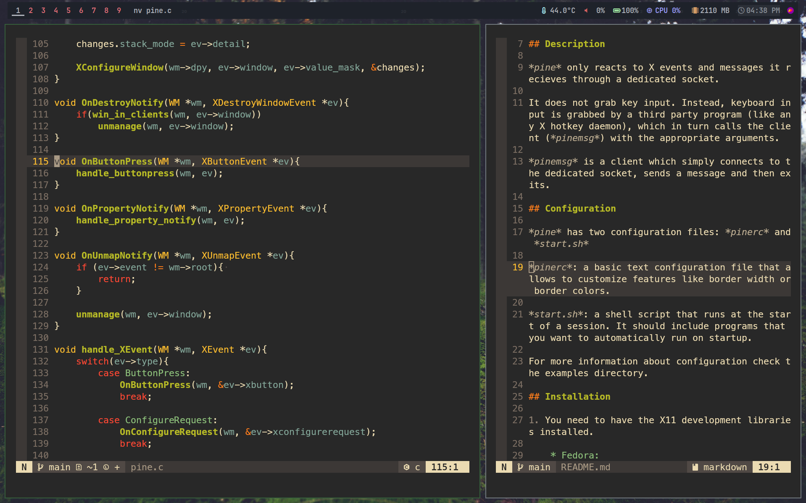
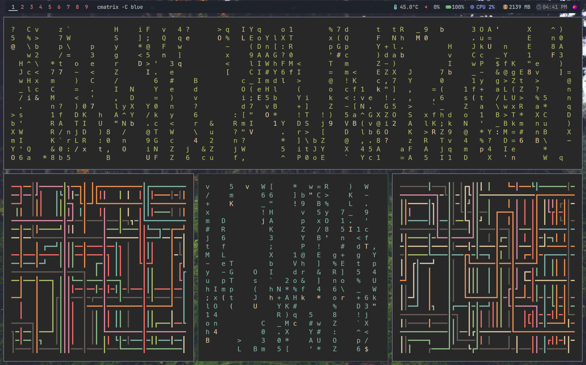

# Pine

*pine* is a simple, lightweight tiling window manager for X11

## Description

*pine* only reacts to X events and messages it recieves through a dedicated socket.

It does not grab key input. Instead, keyboard input is grabbed by a third party program (like any X hotkey daemon), which in turn calls the client (*pinemsg*) with the appropriate arguments.

*pinemsg* is a client which simply connects to the dedicated socket, sends a message and then exits.

## Configuration

*pine* has two configuration files: *pinerc* and *start.sh*

*pinerc*: a basic text configuration file that allows to customize features like border width or border colors.

*start.sh*: a shell script that runs at the start of a session. It should include programs that you want to automatically run on startup.

For more information about configuration check the examples directory.

## Installation

1. You need to have the X11 development libraries installed.

    * Fedora:

        `sudo dnf install libX11-devel make gcc`

    * Arch:

        `sudo pacman -S libx11 base-devel`

    * Ubuntu/Debian:

        `sudo apt install libx11-dev build-essential`

2. Compile and install the binaries:

    `make && make install`

3. Create the `$XDG_CONFIG_HOME/.config/pine/start.sh` file. 

    A third party program that grabs input (like the sxhkd hotkey daemon) is mandatory, as the window manager does not react to keyboard input. 

    You must start the hotkey daemon as a background process in your *start.sh*. 

    *start.sh* is the place where you should launch your status bar, notification daemon etc.

4. Create the `$XDG_CONFIG_HOME/.config/pine/pinerc` file.

    This is a very basic text based config file. It is not required to run the window manager.

    For syntax information, check the examples directory.

## Technical Overview

*pine* follows a client-server model. As I mentioned earlier, *pine* does not grab any keyboard input, but instead it listens on a socket.

When called, *pinemsg* connects to the dedicated socket and sends the arguments that were passed to it. *pine* sleeps until the socket is activated or it recieves an X event. This is achieveed through using a file descriptor set and select(). This usage of IPC allows for a highly modular setup, where all your keybinds are not tied to a single window manager.

Performance in X window managers is usually bottlenecked by Xlib calls rather than the code itself (this might not be the case for XCB). Thus, optimization using Xlib is only possible to a certain extent.

Currently, *pine* only features two tiling modes: master stack and monocle. These are achieved splitting the screen into smaller rectangles multiple times.

*pine* supports a subset of the EWMH and ICCCM standards, which is sufficient to run quite a few polybar modules.

Finally, *pine* is a non-reparenting window manager, which improves simplicity and readibility of the project. Reparenting was almost redundant, since *pine* would not draw any title bars or sophisticated window borders by design.
